# Graduation Project
This e-commerce app project is built as Patika & Protein React Bootcamp graduate project.

Live Demo is Here: [Live Demo](https://react-bootcamp-week6-advanced-marvelapi.vercel.app/)

## Introduction
This project, made with Reactjs and Nextjs, is a second-hand site that allows users to register and sell products and buy products. The project is responsive for desktop and mobile.

In the project, operations are carried out over the api and these operations are as follows;

-Process of registering
-Logging in
-Listing products by categories
-Sending offers or purchasing requests to products
-Listing and approving or rejecting incoming offers
-Seeing the status of discarded offers
-Viewing product details
-Adding products

## Used technologies
-Reactjs
-Nextjs
-Context API
-SASS
-Axios
-Toastify
-Headless UI
-Vercel

## Screens for Desktop
### Login Page

### Register Page

### Home Page

### Product Detail Page

### Offer Dialog
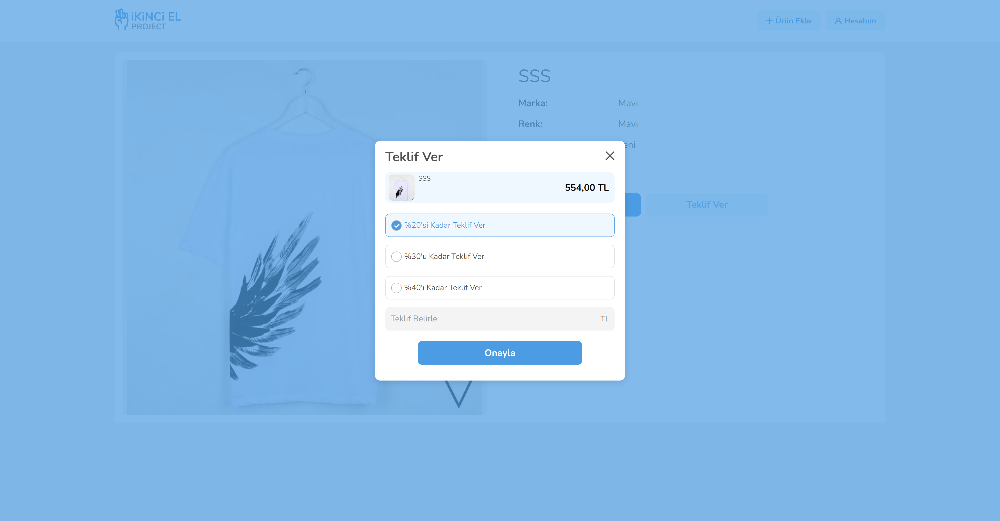

### Buy Dilaog
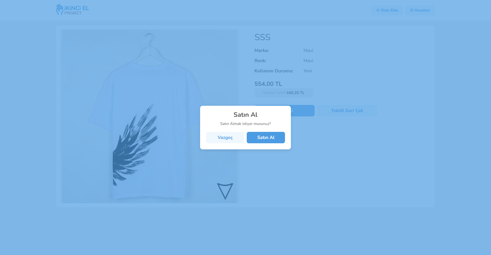

### Account Page
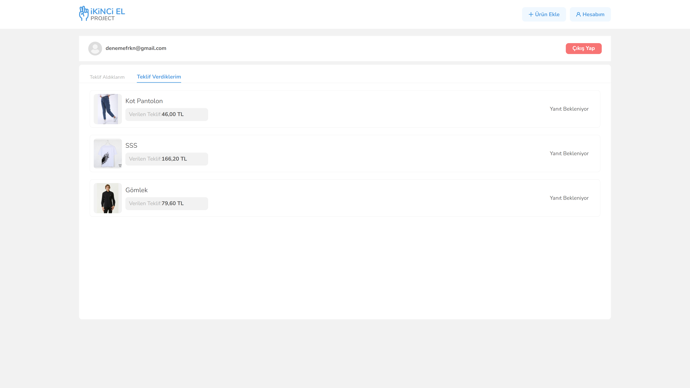
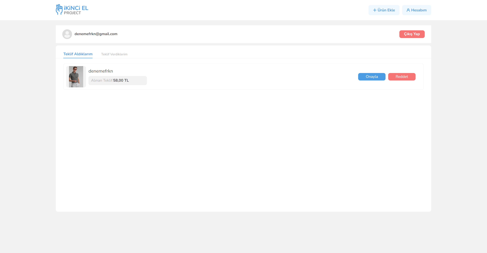

### Add Product Page
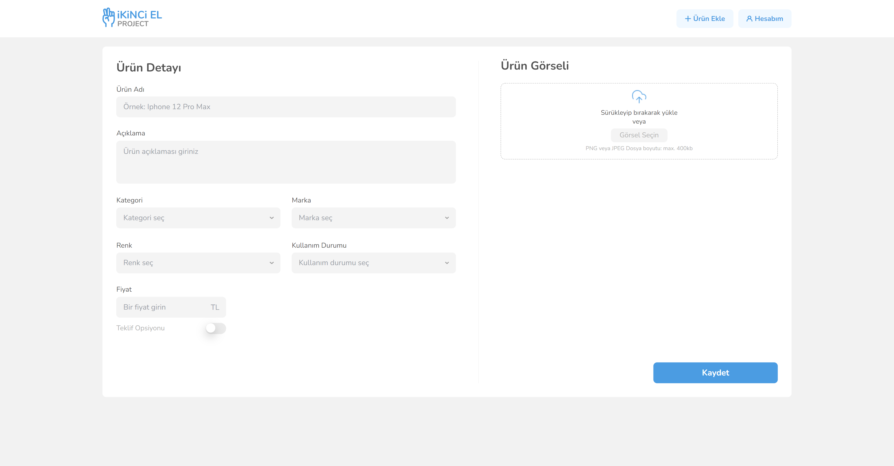
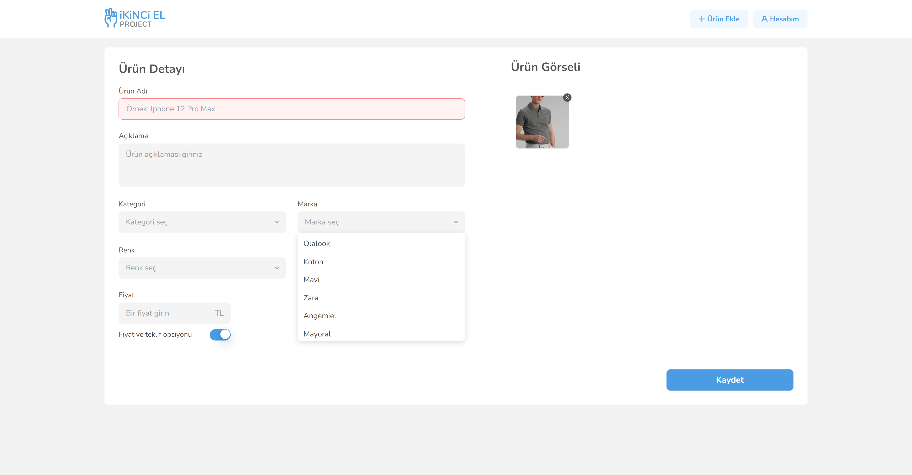

## Screens for Mobile
### Login Page
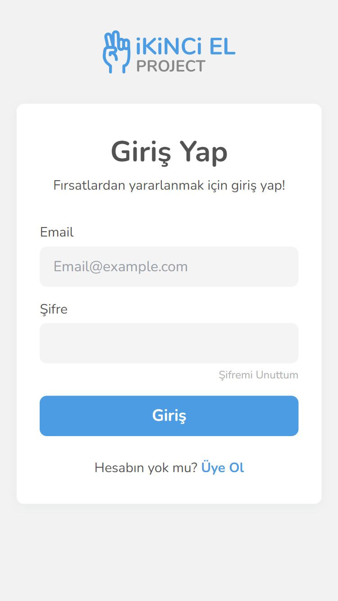

### Register Page
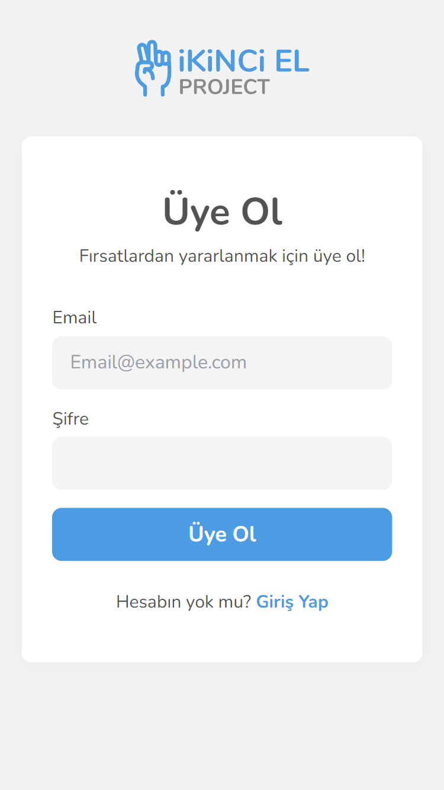

### Home Page
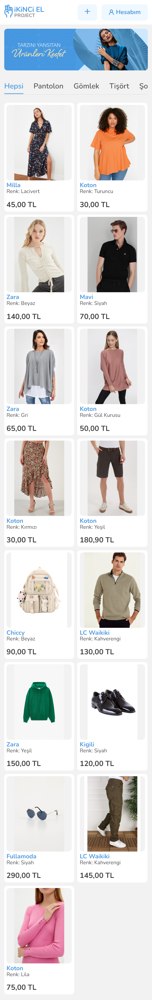

### Product Detail Page
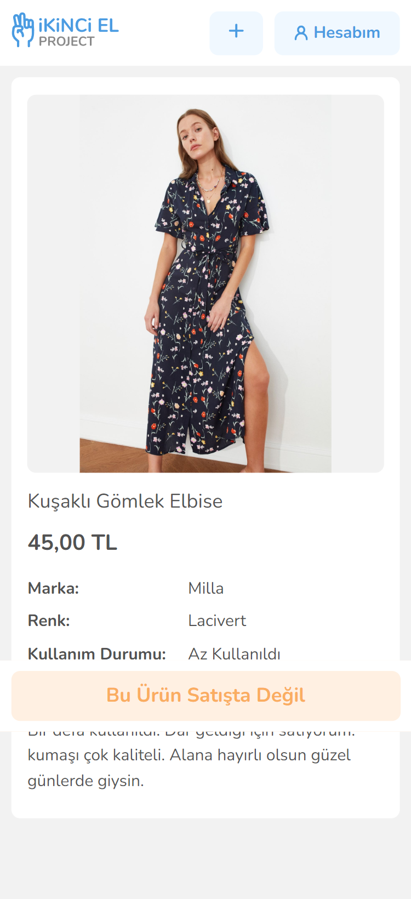

### Offer Dialog
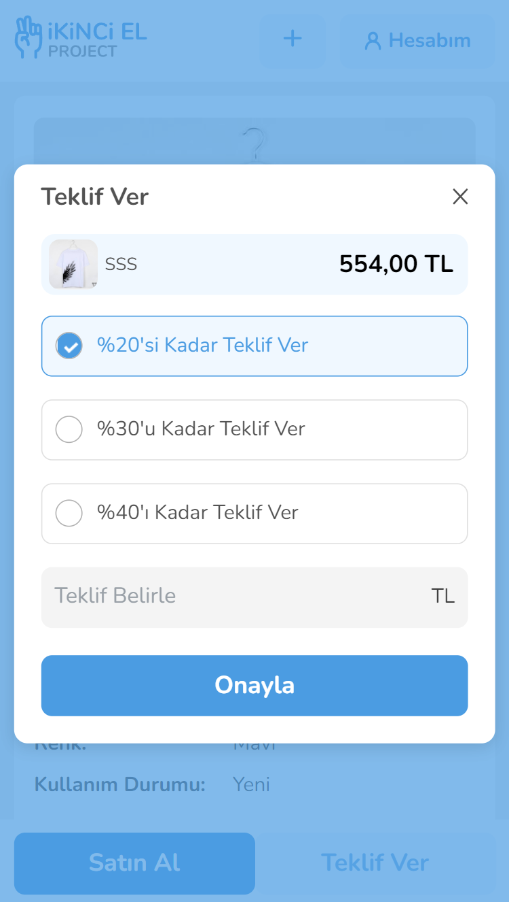

### Buy Dilaog

### Account Page
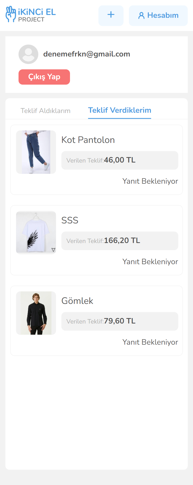

### Add Product Page
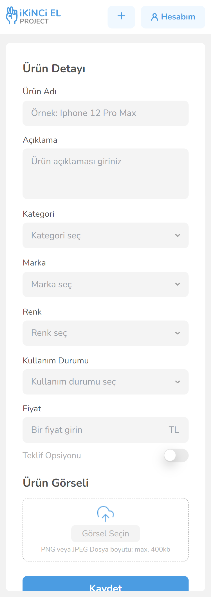
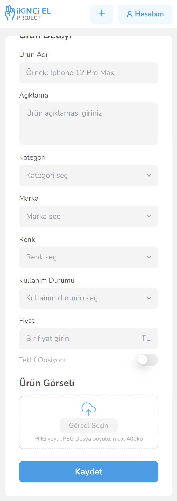
